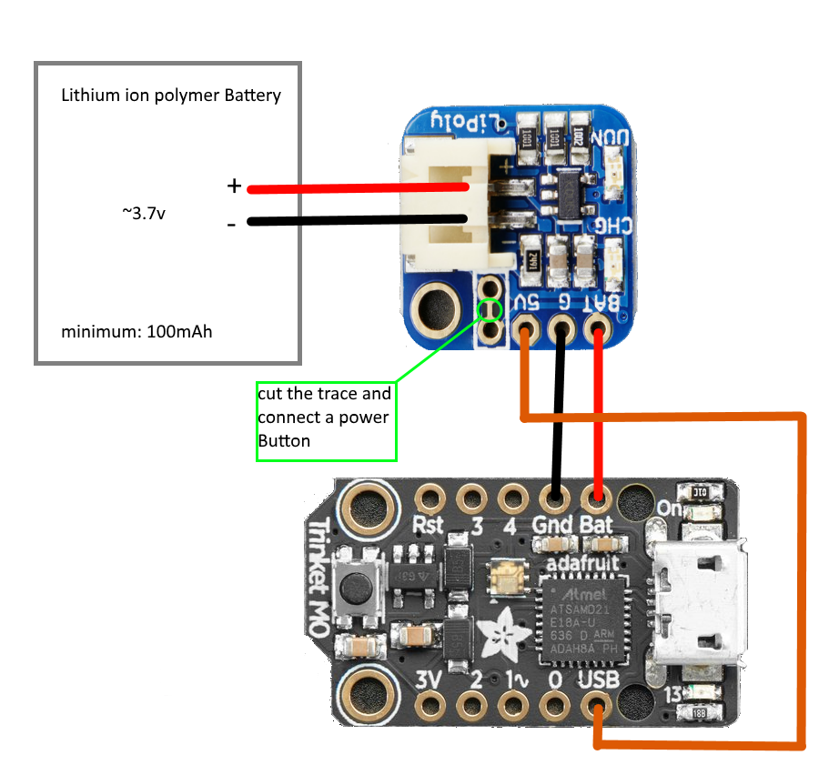
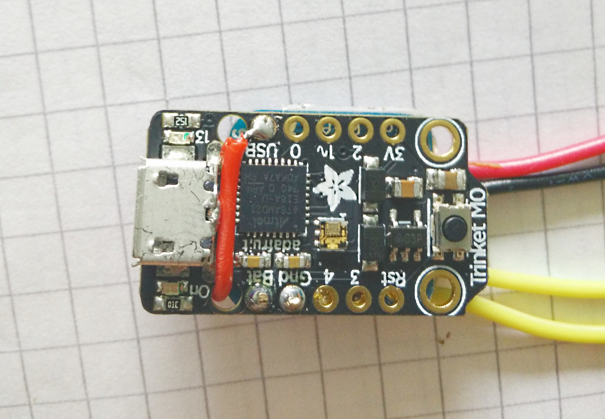

# sam-fusee-launcher
Fusee Launcher for the adafruit trinket m0 board. Based on [sam fusee launcher](https://github.com/atlas44/sam-fusee-launcher).

Build and tested with Arduino SDK.

# Install

Go through [trinket m0: arduino-ide-setup](https://learn.adafruit.com/adafruit-trinket-m0-circuitpython-arduino/arduino-ide-setup) and [trinket m0: arduino-ide-setup2](https://learn.adafruit.com/adafruit-trinket-m0-circuitpython-arduino/using-with-arduino-ide)

Summary:
* Download and install arduino IDE http://www.arduino.cc/en/Main/Software
* In Arduino: go to "Prefences" and add to "Additional Board Manager URLs" followin URL:
*  `https://adafruit.github.io/arduino-board-index/package_adafruit_index.json`
* go to "Tools > Board > Board Manager" and select Type: All and
* Install "Adafruit SAMD Boards" by Adafruit (not sure if required: Arduino - Boards SAMD)
* Select the Trinket M0 with "Tools > Board > Adafruit Trinket M0"

Go to Sketch > Include Library > Manage Libraries
Install USBHOst and Adafruit DotStar

Connect the Trinket m0 to your computer and double Click on the Reset Button.
Your computer should detect the Trinket m0 automatically (On win7 install this [driver](https://github.com/adafruit/Adafruit_Windows_Drivers/releases/download/2.2.0/adafruit_drivers_2.2.0.0.exe))

Got to Tools > Port and select your conneted trinket m0

Then Verify/Compile (Ctrl + R)
If no errors appear
Upload (Ctrl + U)

# Update the Payload
download your favorit [payload](https://github.com/CTCaer/hekate/releases) as a `.bin` file
run the python script `tools/binConverter.py` with the path to the file as an argument
`python binConverter.py "C:\pathToMyPayload\hekateNew.bin` or just drag the bin file on the script

in the same folder as the .bin file is located, a new .h file should appear. Copy the new file to the main folder and in the main.ino go to line 6 `#include "hekate_ctcaer_2.3.h"` and rename it to your new file `#include "hekateNew.h`

Then just compile and upload.

# Hardware
[trinket m0](https://www.adafruit.com/product/3500) + [liPoly charger](https://www.adafruit.com/product/2124) + Button + 150mAh LiPoly Battery

Power consumption:
* Idle with error and power LED: 3.5mA
* Idle with only power LED: 1.3mA
* Running: 12.7mA

Thanks to:
* [atlas44](https://github.com/atlas44/sam-fusee-launcher)
* [CTCaer](https://github.com/CTCaer/hekate)
* [Ninoh-FOX](https://www.elotrolado.net/hilo_tutorial-crea-tu-propio-dongle-portatil-para-cargar-payloads-it-is-easy_2287822)
* and everyone else i forgot

